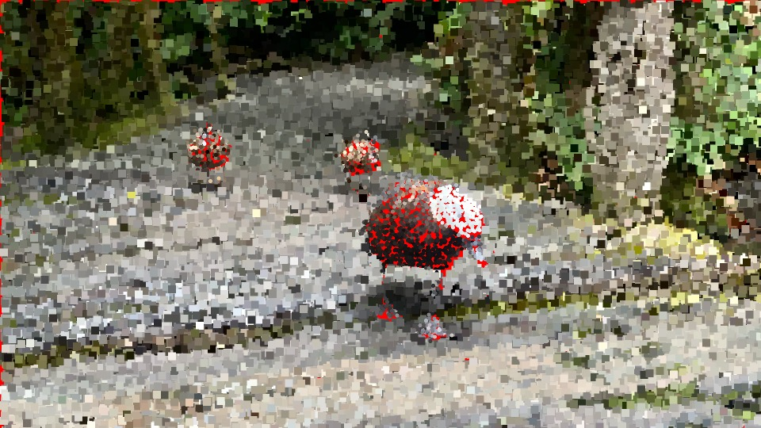
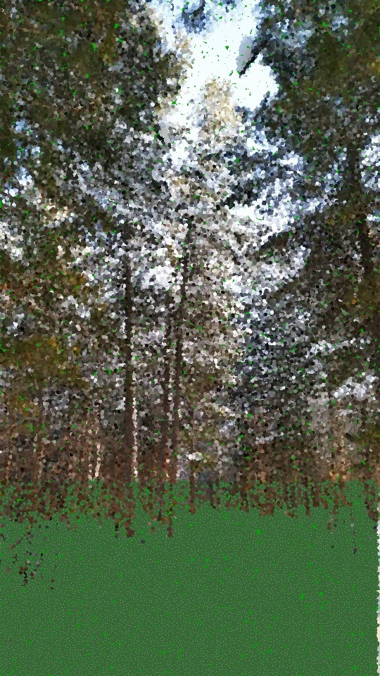

## Creative Coding 2: Custom Pixel

DESCRIPTION:
Time Travel project based on AI training. My idea was to turn my home city winter photos into summer photos. With AI detecting snow, the code draws grass and flowers on the mask. Back in Russia, winter is one of the longest seasons; people can’t wait for summer to come, as in winter everything is grey and depressing. But as summer comes in, everything becomes so picturesque.

PROGRESS:

1st EXPREMINETS
AT first I started experimenting with some birds photos since I wasn't sure of the final idea at first, but I really wanted it to be based on nature

FIRST TESTS OF THE FINAL IDEA:

The pixels change did make it look like summer season, but its too flat, more pixels work need to be done 

FLOWERS IDEA:

To make it more realistic and summer vibe, I added new pixels as if its flower just to test the outcome, later will be working on its deatils

TRAINING:
Apart from usual masks, I've been experimenting with colour masks, which allows to highlight small details which worked but didn't make the difference for AI

Result:

While it did detects snow, it still sruggles to highlight small details, such snow between trees

DETAILS:
To make the grass look morerealistic, I played with 2 different tones of greena and added flowers thats appear through the grass.

